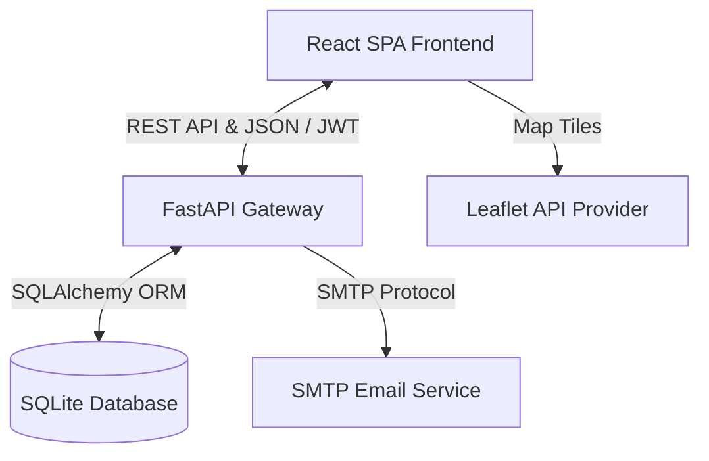

# ⛰️ KazWonder (7 Wonders of Kazakhstan)

[](https://react.dev/)
[](https://tailwindcss.com/)
[](https://fastapi.tiangolo.com/)
[](https://www.python.org/)
[](https://vite.dev/)
[](https://www.sqlalchemy.org/)
[](https://jwt.io/)
[](https://github.com/astral-sh/uv)

**KazWonder (7 Wonders of Kazakhstan)** — современное, высокопроизводительное Full-Stack веб-приложение для бронирования туров и виртуального знакомства с семью уникальными чудесами природы и истории Казахстана. 

Проект разработан с учетом лучших практик проектирования ПО, демонстрирует профессиональное владение архитектурными паттернами, современным инструментарием (Vite, React 19, FastAPI, UV) и упором на безопасность, чистоту кода и отзывчивый интерфейс (UX/UI).


---

## 🌟 Основные возможности (Core Features)

*   🗺️ **Интерактивная карта (GIS Integration):** Полноценные геокарты на базе [Leaflet](https://leafletjs.com/) (`react-leaflet`), показывающие точное местоположение природных чудес Казахстана, с интерактивными маркерами и всплывающими подсказками.
*   🔐 **Безопасная аутентификация и профили:** Полноценная сессионная JWT-авторизация (JSON Web Tokens) с использованием защищенных куки/заголовков. Хеширование паролей на бэкенде с помощью криптографического алгоритма **Argon2** (passlib). Личный кабинет с возможностью обновления данных пользователя.
*   🎒 **Динамическая система бронирования туров:** Интерактивный интерактивный виджет заказа, расчет стоимости на лету, сохранение истории заказов с возможностью отслеживания статуса.
*   ✍️ **Интерактивные отзывы (Social Proof):** Раздел комментариев с оценками (рейтинг звезд) и плавной бесконечной каруселью (`ReviewsInfinite.jsx`), создающей премиальный визуальный эффект.
*   📧 **Система обратной связи & Поддержка:** Интеграция с SMTP-сервером для отправки писем-уведомлений и заявок технической поддержки в реальном времени.
*   🌓 **Смена тем (Dark/Light Mode):** Бесшовный переключатель тем с сохранением предпочтений пользователя в `localStorage` и поддержкой нативных возможностей Tailwind CSS v4.
*   📱 **100% Адаптивный UI:** Оптимизирован под мобильные устройства, планшеты и десктопы. Использован современный CSS Grid/Flexbox и оптимизированные микро-анимации.

---

## 🏗️ Архитектура системы (Architecture Overview)

Приложение спроектировано как **Monorepo** с четким разделением ответственности (Separation of Concerns). Бэкенд представляет собой RESTful API с клиент-серверной архитектурой.



### Архитектурные особенности:
1.  **Frontend (React 19 SPA):** 
    *   Модульная структура компонентов (`/components` и `/pages`).
    *   Маршрутизация с использованием **React Router v7** (декларативные роуты, защищенные маршруты для личного кабинета).
    *   Новейший **Tailwind CSS v4** с компиляцией через Vite-плагин `@tailwindcss/vite`, обеспечивающий непревзойденную скорость загрузки стилей и уменьшенный размер бандла.
2.  **Backend (FastAPI):**
    *   Реализован паттерн репозитория/сервиса.
    *   Строгая валидация и типизация данных через **Pydantic v2** (как входных, так и выходных DTO-схем).
    *   Использование **SQLAlchemy 2.0** с асинхронным контекстом (поддерживается расширение под PostgreSQL/MySQL).
    *   Декларативное управление конфигурацией приложения с помощью `pydantic-settings` (типизированный доступ к `.env` с валидацией типов и дефолтных значений).

---

## 🛠️ Технологический стек (Tech Stack)

### Frontend:
*   **React 19** (функциональные компоненты, хуки, оптимизация рендеринга)
*   **Vite 7** (сверхбыстрый сборщик)
*   **Tailwind CSS v4** (Utility-first CSS c поддержкой CSS-переменных нового поколения)
*   **React Leaflet & Leaflet 1.9** (работа с картами и геоданными)
*   **React Router Dom v7** (клиентский роутинг)
*   **FontAwesome React** (иконочный пак)

### Backend:
*   **Python 3.13** (последняя стабильная версия с поддержкой современных фич языка)
*   **FastAPI** (асинхронный веб-фреймворк на базе Starlette и Pydantic)
*   **SQLAlchemy 2.0** (мощная ORM для работы с БД)
*   **PyJWT** (генерация, декодирование и валидация токенов безопасности)
*   **Passlib + Argon2** (промышленный стандарт криптографической защиты паролей)
*   **Uvicorn** (высокопроизводительный ASGI-сервер)
*   **UV** (субсекундный пакетный менеджер для экосистемы Python)

---

## 📂 Структура проекта (Project Tree)

```text
7wondersofkazakhstan/
├── backend/                  # Python FastAPI бэкенд-приложение
│   ├── app/
│   │   ├── api/              # Контроллеры и роуты API (auth, tours, orders, reviews)
│   │   ├── models/           # SQLAlchemy сущности базы данных
│   │   ├── schemas/          # Pydantic DTO схемы (валидация запросов/ответов)
│   │   ├── config.py         # Настройки приложения на базе Pydantic Settings
│   │   ├── database.py       # Инициализация SQLAlchemy Session & Engine
│   │   ├── email_service.py  # Логика отправки писем (SMTP)
│   │   ├── security.py       # Хеширование паролей (Argon2) и логика JWT
│   │   └── utils.py          # Вспомогательные функции
│   ├── main.py               # Точка входа в приложение (Uvicorn)
│   ├── pyproject.toml        # Конфигурация зависимостей бэкенда
│   ├── requirements.txt      # Сгенерированный список зависимостей
│   └── tours.json            # Демонстрационные данные о турах
│
├── frontend/                 # React клиентское приложение
│   ├── src/
│   │   ├── api/              # Клиентские API-запросы (fetch/axios обертки)
│   │   ├── components/       # Переиспользуемые UI-компоненты (Map, Carousel, Review)
│   │   ├── pages/            # Страницы приложения (Index, Tours, Profile, Booking)
│   │   ├── utils/            # Хелперы и утилиты
│   │   ├── main.jsx          # Точка монтирования React
│   │   └── index.css         # Глобальные стили Tailwind CSS v4
│   ├── package.json          # Зависимости и скрипты фронтенда
│   └── vite.config.js        # Конфигурация сборщика Vite
└── README.md
```

---

## 🚀 Быстрый запуск (Installation & Setup)

### Шаг 1: Клонирование репозитория
```bash
git clone https://github.com/your-username/7wondersofkazakhstan.git
cd 7wondersofkazakhstan
```

### Шаг 2: Настройка бэкенда
Бэкенд использует современный пакетный менеджер **uv**. Если он не установлен, вы можете использовать стандартный `pip`.

1. Перейдите в директорию бэкенда:
   ```bash
   cd backend
   ```
2. Создайте файл конфигурации окружения `.env` на основе примера:
   ```bash
   cp example.env .env
   ```
   *Заполните переменные окружения, такие как `JWT__SECRET_KEY` и SMTP-настройки (для отправки почты).*

3. Создайте виртуальное окружение и установите зависимости:
   * **С использованием `uv` (рекомендуется, скорость установки < 2 секунд):**
     ```bash
     uv venv
     source .venv/bin/activate  # На Windows: .venv\Scripts\activate
     uv sync
     ```
   * **С использованием классического `pip`:**
     ```bash
     python -m venv .venv
     source .venv/bin/activate  # На Windows: .venv\Scripts\activate
     pip install -r requirements.txt
     ```
4. Запустите сервер разработки:
   ```bash
   python main.py
   ```
   *Сервер запустится по адресу: `http://localhost:8000`. Интерактивная документация Swagger доступна по адресу `http://localhost:8000/docs`.*

### Шаг 3: Настройка фронтенда
1. Перейдите в директорию фронтенда:
   ```bash
   cd ../frontend
   ```
2. Установите зависимости:
   ```bash
   npm install
   ```
3. Запустите клиент в режиме разработки:
   ```bash
   npm run dev
   ```
   *Приложение будет доступно по адресу `http://localhost:5173`.*

---

## 🛡️ Безопасность и лучшие практики (Security & Best Practices)

Проект демонстрирует зрелый подход к написанию кода и безопасности веб-приложений:

*   **Argon2 Hashing:** Для хранения паролей не используются устаревшие алгоритмы MD5/SHA256. Реализован `Argon2` с переменной солью, устойчивый к атакам методом перебора и GPU-взломам.
*   **JWT с истечением срока действия:** Сессионные токены имеют строгий лимит жизни (по умолчанию 14 дней), проверяются на бэкенде через middleware и защищены от подделки секретным ключом.
*   **Защита от SQL-инъекций:** Использование SQLAlchemy ORM гарантирует параметризацию всех SQL-запросов к базе данных, полностью нивелируя риск SQL-инъекций.
*   **Строгая валидация схем (Type Safety):** FastAPI + Pydantic автоматически отсекают некорректные JSON-запросы на этапе парсинга, возвращая структурированные 422 ошибки валидации клиенту.
*   **Соблюдение CORS (Cross-Origin Resource Sharing):** Бэкенд контролирует источники запросов, предотвращая несанкционированный доступ с чужих доменов.
*   **Clean Code & ESLint:** Код фронтенда проходит проверку линтером ESLint с соблюдением актуальных React-хук правил, гарантируя отсутствие утечек памяти и нежелательных сайд-эффектов.

---

*Разработано с ❤️ для демонстрации технических навыков.*
